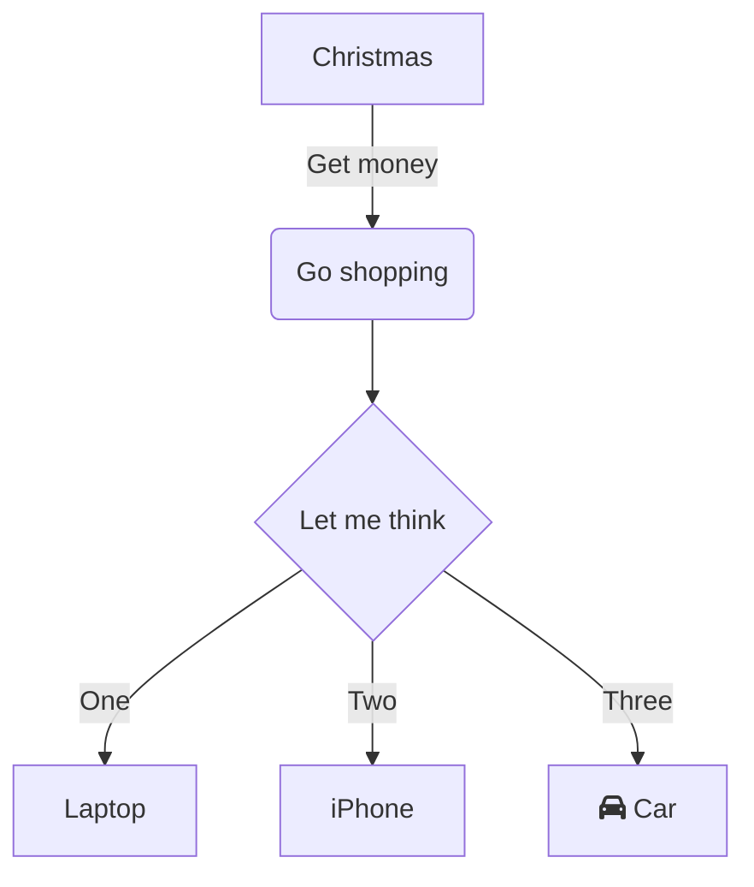

# NavigationLibrary

Compile-time навигация для WPF и Avalonia. Никакой рефлексии в рантайме — вся связь между ViewModel, View и родительскими layout'ами вычисляется на этапе компиляции source generator'ом и кладётся в обычные `Dictionary`.

## Структура:
- [Требования](#требования)
- [Как это устроено](#как-это-устроено)
- [Установка](#установка)
- [Инициализация](#инициализация)
  - [Avalonia](#avalonia)
  - [WPF](#wpf)
- Использование
  - [Базовые классы](#базовые-классы-viewmodel)
    - [CommunityToolkit.Mvvm](#с-communitytoolkitmvvm)
    - [INotifyPropertyChanged](#с-inotifypropertychanged-напрямую-wpf)
  - [Навигация](#навигация)
  - [Пример использования](#пример-использования-с-communitytoolkitmvvm)
- [Зачем `ILayout` и его `Content`](#зачем-нужен-ilayout-и-что-делать-с-его-content-в-xaml)
- [Диагностика на этапе компиляции](#диагностика-на-этапе-компиляции)
- [Troubleshooting](#troubleshooting)


## Требования

- .NET 8
- WPF (`net8.0-windows`) или Avalonia (`net8.0`, пакет `Avalonia` подключается вашим проектом самостоятельно)
- `Microsoft.Extensions.DependencyInjection` версии `8.0.1` или новее — библиотека сама тянет `Microsoft.Extensions.DependencyInjection.Abstractions 8.0.2`, а `IServiceCollection`/`ServiceProvider` (см. [Инициализацию](#инициализация)) нужно подключать в приложении отдельно

## Как это устроено

Библиотека описывает связи между экранами тремя способами прямо на ViewModel:

- `[View<TView>]` — какой View отображает эту ViewModel. **Обязателен** для любого не абстрактного класса, реализующего `INavigationTarget` — если забыть его поставить, проект просто не скомпилируется (ошибка `NAV001`).
- `[ParentLayout<TLayout>]` — в каком layout'е показывать эту ViewModel при навигации. Если layout является корневым (например `WindowViewModel`), то используем `[Root]`
- `INavigationTarget` / `INavigationTarget<TParameter>` — маркер «это экран, которым управляет навигация», второй вариант даёт `OnNavigatedTo(TParameter parameter)` для приёма параметра.
- `ILayout<TDefaultContent>` — для классов-контейнеров (окно, вкладка, что угодно с `Content`), которые сами показывают вложенный `INavigationTarget`.

Source generator анализирует эти атрибуты и интерфейсы в **проекте, который подключил библиотеку**, и генерирует:

- `NavigationRegistry` — реализацию `INavigationRegistry` с готовыми словарями `View → ViewModel`, `ViewModel → ParentLayout`, `ViewModel → (ParameterType, OnNavigatedTo)`, `Layout -> DefaultContent`.
- `DataTemplatesOutput` — регистрацию `DataTemplate`/`FuncDataTemplate` для каждой пары ViewModel/View, под WPF или Avalonia (определяется автоматически по тому, какие сборки подключены к проекту).
- Один метод `AddNavigation(...)`, который регистрирует всё сразу в DI.
- Метод `InitializeNavigationRoot`, который находит `[Root]`, регистрирует его, и отдается его Instance для передачи в DataContext.

> **Важно:** `AddNavigation(...)` — это не часть библиотеки, а код, который генератор пишет *в вашем проекте* на основе найденных классов, реализующих `INavigationTarget`. Пока в проекте нет ни одного такого класса (с `[View<TView>]`, `[ParentLayout<T>]`/`[Root]` и т.д.), метод `AddNavigation` просто не будет сгенерирован, и вызов не скомпилируется. Порядок действий такой: сначала опишите хотя бы одну ViewModel/Layout как в разделе [Базовые классы ViewModel](#базовые-классы-viewmodel), и только потом подключайте `AddNavigation(...)` в `App`.

## Установка

Пакет пока не опубликован на nuget.org — `.nupkg` доступен в разделе [релизов](../../releases). Установка займёт на одну строку больше, чем обычно: нужно сначала скачать файл и указать локальную папку как источник пакетов.

**1. Скачайте `.nupkg`**

Возьмите файл `NavigationLibrary.1.0.1.nupkg` из [релизов](../../releases) этого репозитория (или из корня, если он закоммичен туда) и положите в любую папку, например `C:\NuGetLocal` или `~/NuGetLocal`.

**2. Укажите эту папку как источник пакетов**

Проще всего — добавить `NuGet.config` рядом с вашим `.sln`:

```xml
<?xml version="1.0" encoding="utf-8"?>
<configuration>
  <packageSources>
    <add key="Local" value="C:\NuGetLocal" />
    <add key="nuget.org" value="https://api.nuget.org/v3/index.json" />
  </packageSources>
</configuration>
```

Либо тем же способом через UI (Rider: `NuGet(Alt+Shift+7) → Sources`; Visual Studio: `Tools → NuGet Package Manager → Package Sources`) — добавить папку как ещё один источник в общий файл конфигурации, ничего не удаляя.

> Расположение общего файла `NuGet.Config` по пути: `C:\Users\{User}\AppData\Roaming\NuGet\NuGet.Config`

**3. Подключите пакет как обычно**

Дополнительно, установив пакет `Microsoft.Extensions.DependencyInjection` v8.0.1 (см. [требования](#требования))

```xml
<ItemGroup>
    <PackageReference Include="Microsoft.Extensions.DependencyInjection" Version="8.0.1" />
    <PackageReference Include="NavigationLibrary" Version="1.0.1" />
</ItemGroup>
```

После этого NuGet подхватит `.nupkg` из локальной папки — дальше всё работает точно так же, как с обычным пакетом из nuget.org, включая генератор (он уже упакован внутри `analyzers/dotnet/cs/`, отдельно подключать ничего не нужно).

> Если после обновления версии в репозитории пакет не подхватывается — почистите кэш NuGet: `dotnet nuget locals all --clear`, затем `dotnet restore`. NuGet кэширует пакеты по номеру версии и может не заметить, что файл в локальной папке обновился.

## Инициализация

### Avalonia

```csharp
public partial class App : Application
{
    public override void Initialize()
    {
        AvaloniaXamlLoader.Load(this);
    }

    public override void OnFrameworkInitializationCompleted()
    {
        var services = new ServiceCollection();
        services.AddNavigation(DataTemplates);

        var provider = services.BuildServiceProvider();

        if (ApplicationLifetime is IClassicDesktopStyleApplicationLifetime desktop)
        {
            desktop.MainWindow = new WindowView
            {
                DataContext = provider.InitializeNavigationRoot()
            };
        }

        base.OnFrameworkInitializationCompleted();
    }
}
```

### WPF

```csharp
public partial class App : Application
{
    protected override void OnStartup(StartupEventArgs e)
    {
        var services = new ServiceCollection();
        services.AddNavigation(Resources);

        var provider = services.BuildServiceProvider();

        var window = new WindowView
        {
            DataContext = provider.InitializeNavigationRoot()
        };
        window.Show();
    }
}
```

`AddNavigation` принимает `ResourceDictionary` (WPF) или `DataTemplates` (Avalonia) — именно туда и регистрируются шаблоны. `InitializeNavigationRoot<TRoot>()` создаёт корневой `ILayout` и связывает его с навигационным состоянием — вызывается один раз, для самого верхнего layout'а приложения (обычно окно).

## Базовые классы ViewModel

Библиотека не диктует, как именно у вас реализовано уведомление об изменении свойств — она работает через любой `INavigationTarget`/`ILayout`. Ниже — два готовых варианта на выбор.

### С CommunityToolkit.Mvvm

```csharp
public abstract class NavigationTarget : ObservableObject, INavigationTarget;

public abstract class NavigationTarget<TParameter> : ObservableObject, INavigationTarget<TParameter>
{
    public abstract void OnNavigatedTo(TParameter parameter);
}

public abstract partial class Layout<TDefaultContent> : ObservableObject, ILayout<TDefaultContent>
    where TDefaultContent : INavigationTarget
{
    [ObservableProperty] private INavigationTarget _content = null!;
}
```

### С INotifyPropertyChanged напрямую (WPF)

```csharp
public abstract class ObservableViewModel : INotifyPropertyChanged
{
    public event PropertyChangedEventHandler? PropertyChanged;

    protected virtual void OnPropertyChanged([CallerMemberName] string? propertyName = null)
    {
        PropertyChanged?.Invoke(this, new PropertyChangedEventArgs(propertyName));
    }

    protected bool SetField<T>(ref T field, T value, [CallerMemberName] string? propertyName = null)
    {
        if (EqualityComparer<T>.Default.Equals(field, value)) return false;
        field = value;
        OnPropertyChanged(propertyName);
        return true;
    }
}

public abstract class NavigationTarget : ObservableViewModel, INavigationTarget;

public abstract class Layout<TDefaultContent> : ObservableViewModel, ILayout<TDefaultContent>
    where TDefaultContent : INavigationTarget
{
    private INavigationTarget _content = null!;

    public INavigationTarget Content
    {
        get => _content;
        set => SetField(ref _content, value);
    }
}
```

## Навигация

Для навигации существует `INavigationService`, который предоставляет все необходимые методы:

```csharp
public interface INavigationService
{
    void NavigateTo<TDestination>() where TDestination : INavigationTarget;
    void NavigateTo(Type destinationType);

    void NavigateTo<TDestination, TParameter>(TParameter parameter) where TDestination : INavigationTarget<TParameter>;
    void NavigateTo(Type destinationType, object? parameter);
}
```

Он регистрируется автоматически внутри `AddNavigation(...)' - для использования, получите его через конструктор ViewModel (см. [Примеры](#пример-использования-с-communitytoolkitmvvm))

## Пример использования (с CommunityToolkit.Mvvm)

```csharp
[Root]
[View<WindowView>]
public partial class WindowViewModel : Layout<MainViewModel>
{
    [ObservableProperty] private string _greeting = "Welcome to Avalonia!";
}

[ParentLayout<WindowViewModel>]
[View<MainView>]
public partial class MainViewModel(INavigationService navigationService) : NavigationTarget
{
    [ObservableProperty] private string _greeting = "";

    [RelayCommand]
    private void Some() => navigationService.NavigateTo<SecondViewModel, string>("Some param");
}

[ParentLayout<WindowViewModel>]
[View<SecondView>]
public class SecondViewModel(INavigationService navigationService) : NavigationTarget<string>
{
    public override void OnNavigatedTo(string parameter)
    {
        Console.WriteLine($"Param from navigation: {parameter}");
    }
}
```

`WindowViewModel` — корневой layout, поэтому у него `[Root]`. `MainViewModel` и `SecondViewModel` указывают `[ParentLayout<WindowViewModel>]` — при навигации на них библиотека сама найдёт `WindowViewModel` в текущем дереве и подставит их в его `Content`.

`navigationService.NavigateTo<SecondViewModel, string>("Some param")` вызовет `SecondViewModel.OnNavigatedTo("Some param")` сразу после создания экземпляра — без единого `Activator`/`MethodInfo.Invoke`, вызов компилируется напрямую в сгенерированном коде.

## Зачем нужен `ILayout` и что делать с его `Content` в XAML

`ILayout<TDefaultContent>` — это не про визуальную структуру, а про то, что внутри есть **одна изменяемая область**, куда навигация подставляет текущий экран. Сам layout (окно, панель, что угодно) рисует всё остальное — заголовки, меню, статичные части — а `Content` отдаёт под конкретный `INavigationTarget`.

На практике это выглядит как один `ContentControl`, забинденный на `Content`, или с статичными частями:

**Avalonia:**

```xml
<Window xmlns="https://github.com/avaloniaui"
        xmlns:x="http://schemas.microsoft.com/winfx/2006/xaml"
        xmlns:vm="using:AvaloniaApplication1.ViewModels"
        x:Class="AvaloniaApplication1.Views.WindowView"
        x:DataType="vm:WindowViewModel">
    <Design.DataContext>
        <vm:WindowViewModel />
    </Design.DataContext>

    <Grid RowDefinitions="Auto, *, Auto">
        <TextBlock Grid.Row="0" Text="Header"/>
        
        <ContentControl Grid.Row="1" Content="{Binding Content}"/>
        
        <TextBlock Grid.Row="2" Text="Footer"/>
    </Grid>
</Window>
```

**WPF:**

```xml
<Window x:Class="WpfApp1.Views.Window.WindowView"
        xmlns:viewModel="clr-namespace:WpfApp1.ViewModels.Window"
        d:DataContext="{d:DesignInstance Type=viewModel:WindowLayoutViewModel}">
    <Grid> 
        <Grid.RowDefinitions>
            <RowDefinition Height="Auto"/>
            <RowDefinition Height="*"/>
            <RowDefinition Height="Auto"/>
        </Grid.RowDefinitions>
        
        <TextBlock Grid.Row="0" Text="Header"/>
        
        <ContentControl Grid.Row="1" Content="{Binding Content}"/>
        
        <TextBlock Grid.Row="2" Text="Footer"/>
    </Grid>
</Window>
```

`ContentControl` сам разрешает, какой `DataTemplate` использовать для текущего значения `Content` — а эти шаблоны как раз и регистрирует `AddNavigation(...)` при старте приложения (по `[View<T>]` каждой ViewModel). Всё, что вы пишете в XAML layout'а — это статичная «рамка» вокруг одной точки подмены.

## Troubleshooting

Все ошибки ниже — это компиляционные диагностики от source generator'а (код вида `NAVxxx`), а не исключения в рантайме. Компилятор указывает точное место — обычно достаточно почитать текст ошибки и подсказку из этой таблицы.

| Код | Когда возникает | Как исправить                                                                                                                                               |
|---|---|-------------------------------------------------------------------------------------------------------------------------------------------------------------|
| `NAV001` | Класс реализует `INavigationTarget` (напрямую или через `ILayout`), но не помечен `[View<TView>]` | Добавьте `[View<TView>]` над классом, указав View (класс наследуемый от UserControl \ Window), которая должна его отображать                                |
| `NAV002` | Ни один класс в проекте не помечен `[Root]` | Пометьте `[Root]` самый верхний layout приложения (обычно `WindowViewModel`)                                                                                |
| `NAV003` | `[Root]` стоит сразу на нескольких классах | В проекте может быть только один `[Root]` — оставьте его на единственном верхнеуровневом layout'е, у остальных используйте `[ParentLayout<T>]`              |
| `NAV004` | Класс с `[Root]` не реализует `ILayout<TDefaultContent>` | `[Root]` можно ставить только на класс-layout (реализующий `ILayout<T>`), не на обычный `INavigationTarget`                                                 |
| `NAV005` | Класс реализует `INavigationTarget`, но не помечен ни `[ParentLayout<T>]`, ни `[Root]` | Укажите `[ParentLayout<TLayout>]`, в каком layout'е должна отображаться эта ViewModel; если это и есть корень навигации — используйте `[Root]` вместо этого |
| `NAV006` | На одном классе одновременно стоят `[Root]` и `[ParentLayout<T>]` | У корня по определению нет родителя — уберите один из двух атрибутов                                                                                        |
| `NAV007` | Вызван `NavigateTo<TDestination>()` (без параметра), а `TDestination` реализует `INavigationTarget<TParameter>` | Замените вызов на `NavigateTo<TDestination, TParameter>(parameter)` — иначе `OnNavigatedTo` никогда не получит нужные данные                                |

Если ошибка не из этого списка — вероятно, это обычная ошибка компилятора C#, а не диагностика библиотеки; проверьте номер (`NAVxxx` — от генератора, всё остальное — стандартный Roslyn/MSBuild).

Если ошибка связана с отсутствием метода `.AddNavigation()` -> убедитесь, что существует хотя бы 1 класс (зачастую `WindowViewModel`), реализующий `[Root]`, `[View<>]`, `INavigationTarget` (или скрытно через `ILayout<>`).

